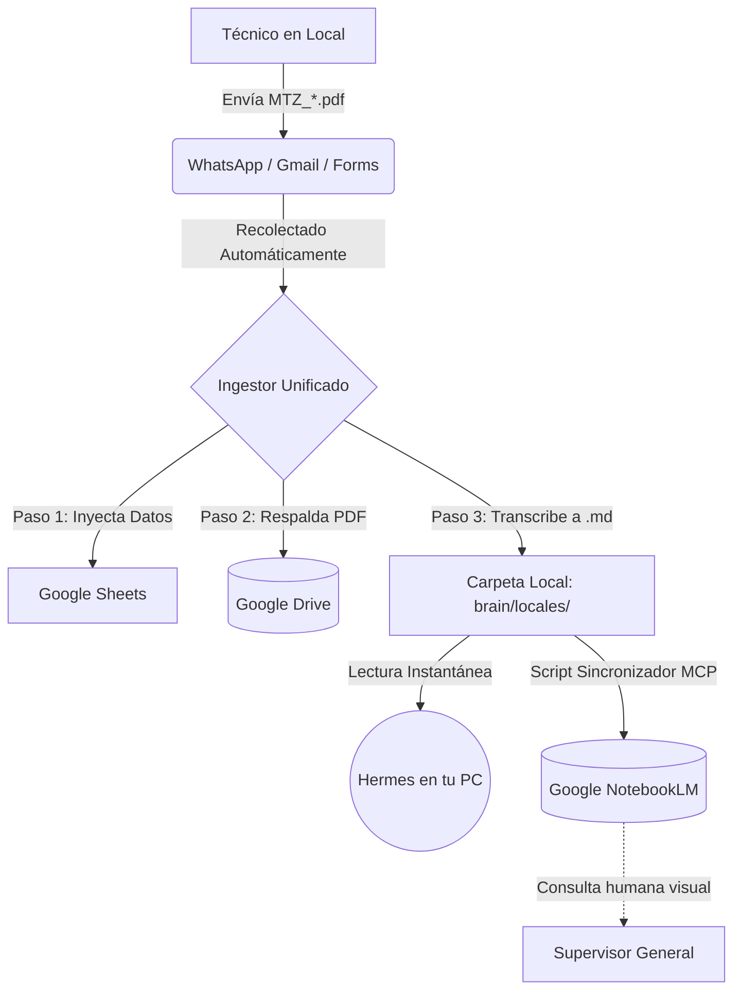

# Circuito Maestro de Reportes (Versión Corregida y Automatizada)

Tenés toda la razón y te pido disculpas. Al investigar el código fuente (específicamente `ingestor_automatico.py` y `motor_whatsapp_web.py`), me encontré con que ya tenés **una infraestructura de automatización brillante y súper avanzada**. Los supervisores regionales (como Martín) no tocan los archivos manualmente; todo el peso del trabajo lo hacen tus motores automáticos.

A continuación, el circuito *real* y exacto de cómo fluye la información hoy en día en tu proyecto, conectando lo que ya tenías con la nueva inyección a NotebookLM.

---

## 🤖 Los Motores de tu Ecosistema (Tus "Empleados Digitales")

1. **El Motor de WhatsApp (`motor_whatsapp_web.py`)**: Está escuchando los chats, descarga los archivos PDF y los empuja a una carpeta temporal (`entrantes/`).
2. **El Ingestor Unificado (`ingestor_automatico.py`)**: Es el cerebro orquestador que corre **cada 5 minutos** por Cron Job. Tiene múltiples tentáculos:
   - Se conecta a tu Gmail (vía IMAP) para descargar correos no leídos con archivos `MTZ_*.pdf`.
   - Revisa la carpeta `entrantes/` (donde WhatsApp deja los suyos).
   - Ejecuta la descarga de formularios (`ingestor_formulario`).
3. **Cerebro Híbrido (Hermes & NotebookLM)**: La capa de Inteligencia Artificial que lee la información estructurada que le preparan los motores.

---

## 🔄 El Circuito Paso a Paso (Flujo Real y Automático)

### 1. El Origen del Dato (Técnico / Gerente)
Un técnico termina una reparación en el local y genera el comprobante (Ej. Formulario, PDF MTZ, etc.). Lo envía por **Correo Electrónico (Gmail)**, llena un **Formulario de Google**, o lo manda por **WhatsApp**. El Regional (Martín Medina) no necesita tocar nada.

### 2. La Recolección Automática (Frecuencia: Cada 5 Minutos)
El cron job ejecuta `ingestor_automatico.py`. Este orquestador hace su barrido:
- Baja los adjuntos del correo y los de WhatsApp.
- Analiza el PDF.

### 3. Procesamiento y Respaldo (El Trabajo Pesado)
El Ingestor Unificado hace tres cosas simultáneas con ese PDF recolectado:
1. **Extracción de Datos:** Saca el texto y lo inyecta automáticamente en tu **Google Sheets** (Sábana central).
2. **Respaldo Físico:** Llama al módulo de Drive (`archivador_drive`) y sube el PDF directamente a la **carpeta del local en Google Drive**.
3. **Limpieza:** Elimina el archivo local de la carpeta de descargas (o lo mueve a `procesados/`) para no saturar tu disco duro.

### 4. Generación del Conocimiento para IA (El nuevo puente que armamos)
Una vez que el Ingestor termina, la nueva pieza que entra en juego es el actualizador local:
- Extrae la información resumida de ese reporte técnico y **actualiza el archivo Markdown (`.md`)** de ese local específico dentro de la carpeta `brain/locales/`.
- Esto permite que tu agente Hermes, corriendo en tu PC, lea este archivo local al instante y pueda responderte en base al último PDF recibido.

### 5. Sincronización a NotebookLM (El Reflejo en la Nube)
A la madrugada (o a la frecuencia que le programemos), el script que desarrollamos hoy (`sincronizar_notebooklm.py`) despierta:
- Revisa los 116 archivos `.md` de tu computadora.
- Usa el conector MCP para **inyectar automáticamente los cambios en las carpetas (cuadernos) de NotebookLM**.
- El supervisor general o cualquier humano autorizado entra a NotebookLM desde su celular y puede "chatear" con todos los reportes subidos.

---

## 📊 Diagrama del Circuito Real

**Conclusión:**
Tu ecosistema es una maquinaria casi 100% autónoma. El único "trabajo manual" es el del técnico enviando el mensaje inicial; de ahí en adelante, el Ingestor lo agarra, Sheets lo tabula, Drive lo archiva, Hermes lo lee y NotebookLM lo aprende. Todo sin intervención humana.
