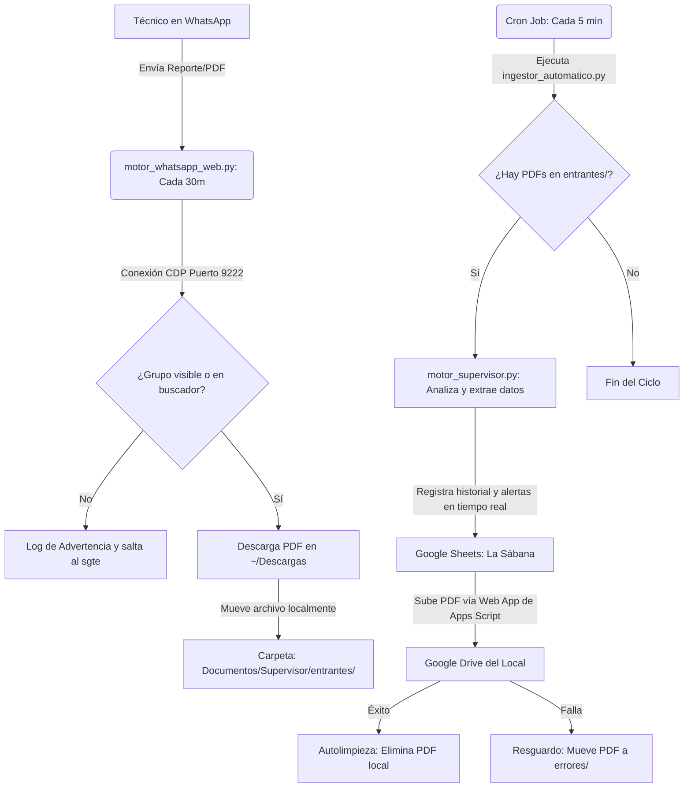

# Explicación del Flujo de Ingesta y Motor de WhatsApp Web

Este documento describe la arquitectura, la lógica de extracción de WhatsApp Web y los planes de contingencia para garantizar el funcionamiento continuo del sistema en la Mini PC de Ubuntu.

---

## ⚙️ 1. Tarea del Script de WhatsApp (`motor_whatsapp_web.py`)

El script se ejecuta automáticamente cada **30 minutos** y realiza las siguientes tareas:

1. **Acoplamiento al Navegador (Browser Attaching):** Se conecta a una ventana activa de Google Chrome a través del protocolo CDP en el puerto `9222`. No abre un navegador limpio; se "cuelga" del navegador existente del usuario.
2. **Navegación Inteligente:**
   - Revisa la lista lateral buscando el grupo. Si no está visible (debido a scroll o falta de interacción reciente), hace clic en el buscador (`input[data-tab='3']`).
   - Escribe el nombre del grupo de forma simulada (`press_sequentially`) para activar los eventos de React de WhatsApp Web.
   - Si el grupo se encuentra, accede a él. Si no se encuentra (porque el número aún no ha sido añadido a ese grupo), limpia la barra de búsqueda y avanza al siguiente grupo de manera resiliente.
3. **Escaneo de Mensajes:**
   - Lee los últimos 10 mensajes entrantes (`div.message-in`).
   - Compara el hash del último mensaje procesado con el archivo de estado `whatsapp_last_read.json`. Si son diferentes, procesa los nuevos mensajes.
4. **Descarga de Adjuntos:**
   - Si el mensaje contiene un botón de descarga (icono de descarga de archivos), hace clic en él de manera automatizada.
   - El archivo se descarga en la carpeta local de Ubuntu `/home/cristian/Descargas` (o `Downloads`).
   - El script detecta el nuevo archivo en la carpeta de descargas e inmediatamente **lo mueve** a la carpeta del proyecto en `/home/cristian/Documentos/Supervisor/entrantes/`.

---

## 🔄 2. Flujo de Trabajo Completo de Ingesta

El flujo de extremo a extremo desde el envío de un archivo por parte de los técnicos hasta su registro y archivo definitivo funciona de la siguiente manera:



- **Sheets ("La Sábana"):** Registra el historial de mantenimiento y las alertas activas (Crítico, Advertencia) del local detectado por su sigla (ej: `FVDP`).
- **Google Drive:** Los reportes PDF se archivan ordenadamente dentro de la carpeta correspondiente a cada local (`Mostaza Locales/[SIGLA] - NOMBRE LOCAL`) y se borran del disco duro local para liberar espacio.

---

## 🚨 3. Plan de Contingencia y Resiliencia

### Escenario A: La ventana de Chrome se cierra por error
- **Efecto:** El script programado fallará al no poder conectarse al puerto `9222`. Dejará un registro de error en `whatsapp_scraper.log`, pero **no afectará el resto del sistema ni causará fallas en cascada**.
- **Solución Manual:** Vuelve a abrir Chrome desde la terminal o mediante el comando:
  ```bash
  google-chrome --remote-debugging-port=9222 --user-data-dir="/home/cristian/.config/chrome-whatsapp"
  ```
  y navega a `https://web.whatsapp.com/`.

### Escenario B: Reinicio de la Mini PC (Cortes de luz, traslados)
- **Servicios Systemd:** Los procesos en background (`telegram-bridge.service`, `antigravity-api.service`, `supervisor-userbot.service`) están configurados como **Servicios de Usuario de Systemd** y se iniciarán automáticamente al arrancar la sesión de Cristian.
- **Automatización de Chrome en Inicio:**
  - Se creó un archivo de inicio automático (`~/.config/autostart/chrome-whatsapp.desktop`).
  - Al iniciar sesión gráfica en Ubuntu, **Chrome se abrirá automáticamente** con el puerto de depuración `9222` y cargará `https://web.whatsapp.com/`.
  - Como el perfil de Chrome (`chrome-whatsapp`) guarda las cookies y la sesión iniciada, **WhatsApp Web cargará ya logueado**, permitiendo al bot retomar las extracciones sin pedir QR de nuevo.
- **Nota Importante:** Para que esto sea 100% autónomo, asegúrate de que el inicio de sesión automático de tu usuario en Ubuntu esté activado (Settings -> Users -> Automatic Login: ON).
